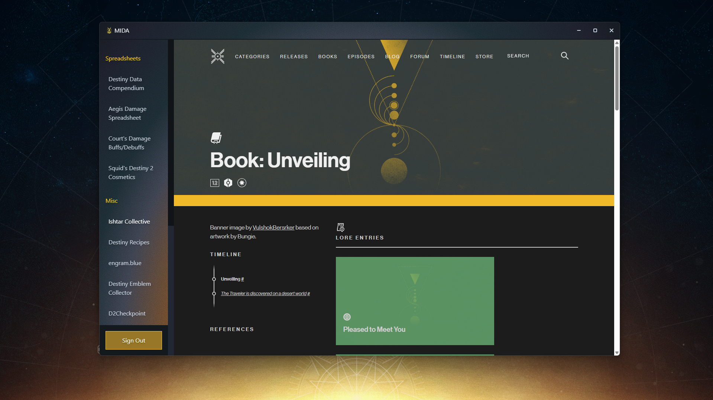
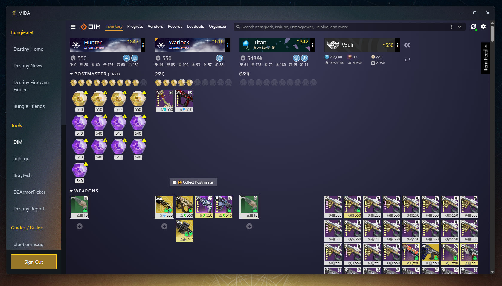
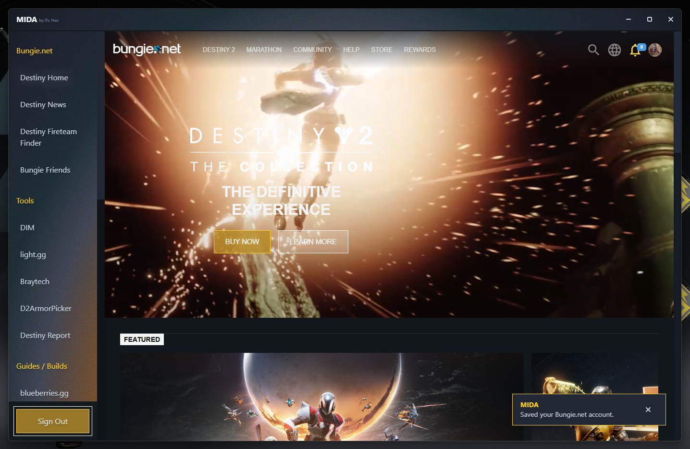

# MIDA

The Destiny 2 Multi-Tool. MIDA puts Bungie.net, DIM, light.gg, raid.report and other Destiny 2 sites in one window, with one shared Bungie.net sign-in.

## Support

If you need help with MIDA or have any issues that you want to resolve or have features you want to add please head over to the [Support Discord](https://discord.gg/7gSFp628Sm) and we will try our best to help you.

## Features

- All your Destiny 2 sites in one sidebar.
- Sign in to Bungie.net once. MIDA keeps only the Bungie.net login and deletes Steam, Xbox and PlayStation sign-in cookies.
- **F2** shows or hides MIDA over the game.
- **Esc** goes back a page. **F5** or **Ctrl+R** reloads.
- Hidden sites close after 30 seconds to save memory.
- Shows a message when a new version is out.

## Screenshots






## Download

Get the installer from [Releases](https://github.com/itznao/mida/releases/latest).

## Build from source

You need [Node.js](https://nodejs.org/).

```bash
npm install
npm run dist
```

## Where MIDA saves data

Everything is in `%LOCALAPPDATA%\MIDA`. **Sign Out** deletes the saved site data. Uninstalling does not delete this folder.

## License

MIDA is **source-available, not open source**. You may read the code, build it and use it for yourself. You may **not** share, redistribute or publish MIDA or a changed version of it. See [LICENSE](LICENSE).

To contribute, see [CONTRIBUTING.md](CONTRIBUTING.md).
